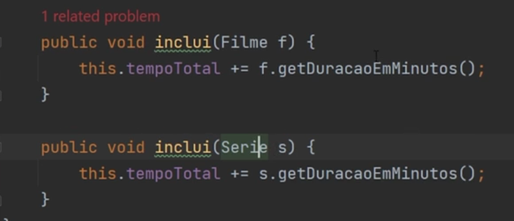
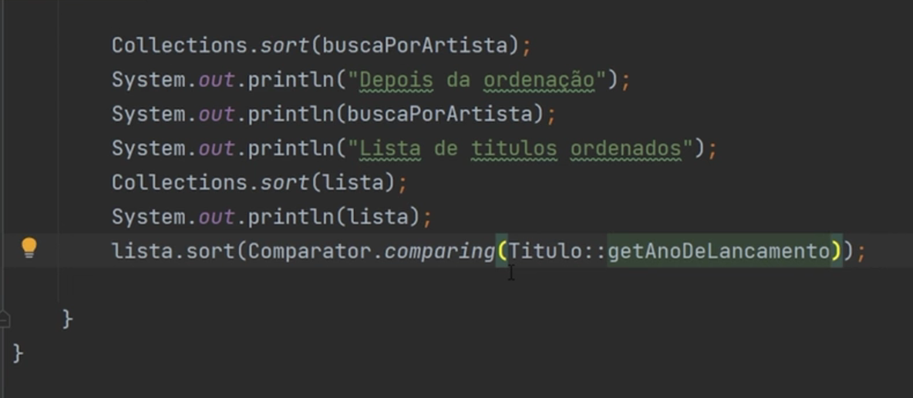
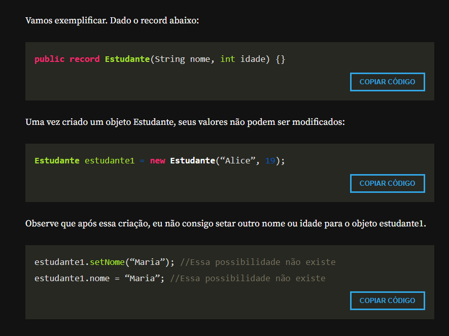

# ONE-Oracle-Aluno-BackEnd
# ONE-Oracle-Aluno-Back-End

Sobre Herança múltipla

Sobrecarga de métodos aceita

#Desafio de orientação a objetos concluído
utilizados:

#Comparable e comparator

#**Interface Map**

O Java oferece diferentes classes para representar uma lista de objetos. Essas classes são úteis em diferentes cenários, dependendo das necessidades de cada aplicação.

As classes mais comuns para representar uma lista no Java são:

ArrayList
A principal característica do ArrayList é que ele é baseado em um array dinâmico. Ele armazena os elementos em uma matriz interna e, conforme novos elementos são adicionados, o tamanho da matriz é automaticamente ajustado para acomodar o novo elemento. Da mesma forma, quando um elemento é removido, o tamanho do array é ajustado para evitar o desperdício de espaço. O ArrayList é amplamente utilizado devido à sua facilidade de uso e eficiência em termos de desempenho.

LinkedList
A classe LinkedList fornece uma lista encadeada de elementos. Diferentemente do ArrayList, que é baseado em um array, o LinkedList é baseado em uma lista encadeada, o que significa que cada elemento da lista é um objeto que contém uma referência para o próximo elemento. Isso permite que os elementos sejam adicionados e removidos de maneira eficiente em qualquer posição da lista, mas pode tornar a pesquisa de um elemento específico menos eficiente.

O LinkedList é uma boa escolha quando a inserção e remoção de elementos em qualquer posição da lista é frequente e quando não é necessário acessar os elementos de forma aleatória.

Vector
A classe Vector é semelhante ao ArrayList, mas é sincronizada, o que significa que é segura para uso em threads concorrentes. No entanto, a sincronização adiciona uma sobrecarga de desempenho, então o Vector pode ser mais lento que o ArrayList em algumas situações.

Stack
A classe Stack implementa uma pilha, que é uma coleção ordenada de elementos onde a inserção e remoção de elementos ocorrem sempre no mesmo extremo da lista. Os elementos são adicionados e removidos em uma ordem conhecida como "last-in, first-out" (LIFO), ou seja, o último elemento adicionado é o primeiro a ser removido. A classe Stack é usada com frequência em algoritmos de processamento de texto, bem como em outras situações em que a LIFO é a maneira natural de organizar os dados.

Uma das características mais importantes do Java é sua vasta biblioteca padrão, que oferece muitas classes e interfaces úteis para os desenvolvedores. Entre elas, estão o Map e o HashMap, que são ferramentas essenciais para associação de chaves e valores em muitas aplicações Java.

Map
O Map é uma interface que permite que os desenvolvedores associem chaves a valores. É uma estrutura de dados útil para muitas aplicações Java, especialmente aquelas que envolvem a manipulação de grandes quantidades de dados, portanto, é comum usá-lo para realizar buscas, atualização e recuperação de elementos por chaves

Ele é implementado por diversas classes, sendo a mais comum delas o HashMap.

HashMap
O HashMap é uma classe que implementa a interface Map usando uma tabela hash para armazenar os pares chave-valor. Ele é conhecido por sua eficiência em termos de tempo de execução. Essa classe tem uma complexidade de tempo O(1) - constante - para inserção, recuperação e remoção de elementos. Isso significa que o desempenho do HashMap não depende do tamanho da coleção de dados!

No entanto, é importante lembrar que o HashMap não mantém a ordem de inserção dos elementos e não garante a ordem dos elementos na saída. Isso ocorre porque a ordem dos elementos depende da função de hash usada para mapear as chaves para índices na tabela hash. Além disso, o desempenho do HashMap pode ser afetado se houver muitas colisões de hash entre as chaves.

Por exemplo:

import java.util.HashMap;
import java.util.Map;

public class ExemploHashMap {

    public static void main(String[] args) {
        //Criando um objeto da classe HashMap que implementa a interface Map
        Map<String, Integer> usandoHashMap = new HashMap<>();

        // Adicionando pares chave-valor
        usandoHashMap.put("Gatos", 1);
        usandoHashMap.put("Cachorros", 2);
        usandoHashMap.put("Roedores", 3);

        // Acessando um valor através de uma chave
        int valor = usandoHashMap.get("Cachorros");
        System.out.println("Valor da chave Cachorros: " + valor);

        // Removendo um par chave-valor
        usandoHashMap.remove("Gatos");

        // Iterando sobre as chaves
        for (String chave : usandoHashMap.keySet()) {
            System.out.println("Chave: " + chave);
            System.out.println("Valor: " + usandoHashMap.get(chave));
        }
    }
}
Copiar código
O resultado será:

Valor da chave Cachorros: 2
Chave: Cachorros
Valor: 2
Chave: Roedores
Valor: 3

#API
MÉTODOS - GET, POST, PUT, DELETE

#Record#

Se a String é imutável, o certo era eu não conseguir atribuir o conteúdo “Alice” à variável nome, correto?

No caso da String e de outras classes imutáveis que citei acima, a variável nome contém uma referência ao objeto da classe String que contém o valor "Maria".

No entanto, quando você tenta alterar o valor da string, o que realmente acontece é que um novo objeto da classe String é criado com o novo valor e a variável é atualizada para armazenar uma referência ao novo objeto.

Por isso, podemos dizer que a classe String é imutável, porque uma vez que um objeto da classe String é criado, ele não pode ser alterado. No entanto, as variáveis que armazenam referências a objetos da classe String podem ser atualizadas para referenciar novos objetos, que são criados a partir do conteúdo do objeto original.

A imutabilidade é importante por várias razões, entre elas:

Concorrência: objetos imutáveis são seguros para uso em ambientes concorrentes, já que não há necessidade de sincronização.
Segurança: objetos imutáveis são seguros contra alterações acidentais ou mal-intencionadas.
Desempenho: objetos imutáveis podem ser armazenados em cache e reutilizados, o que pode melhorar o desempenho.